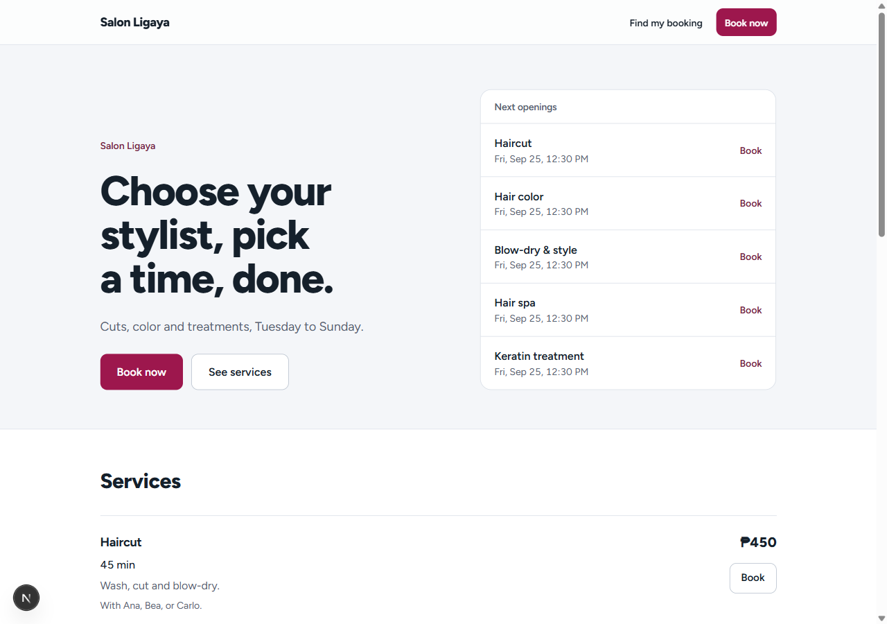
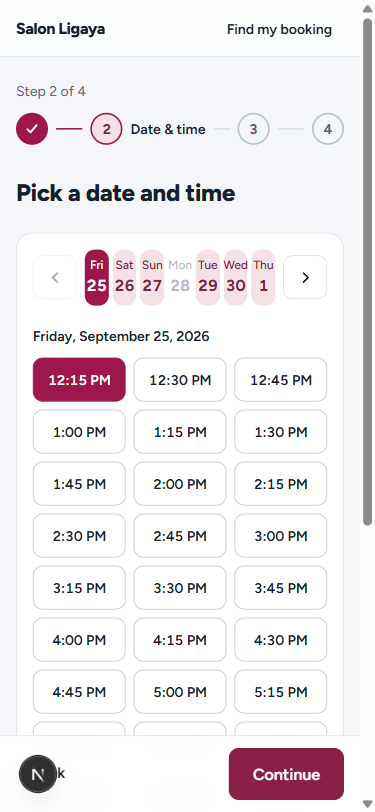
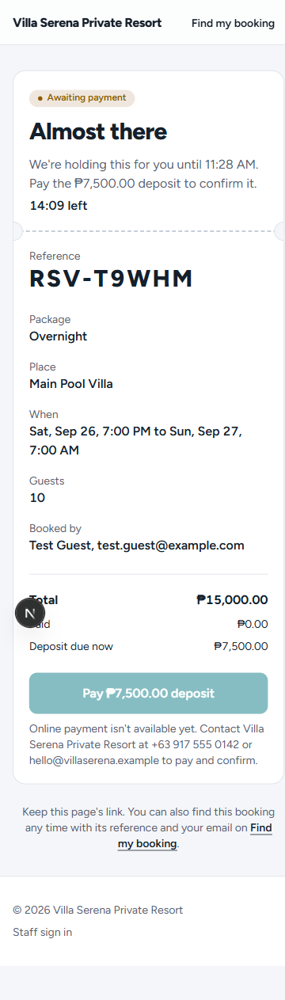
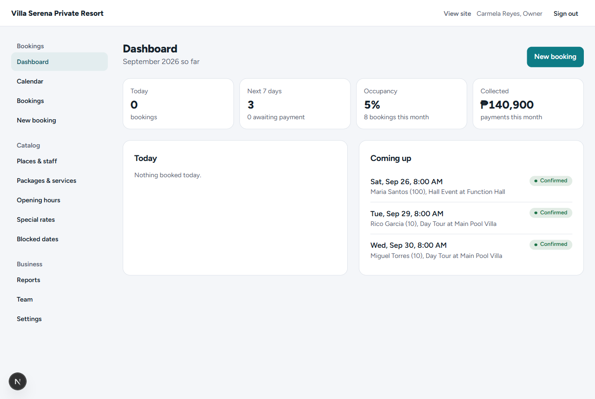

# Reserva

**Booked, paid, confirmed.** A booking engine for small businesses: customers see real availability, pay a deposit online and get an instant confirmation; owners run everything from one admin.

One engine covers two very different kinds of business:

- **Fixed-time packages** (resorts, private pools, event halls): Day Tour 8 AM to 5 PM, Overnight 7 PM to 7 AM the next day, 22 Hours 2 PM to noon.
- **Time slots** (courts, salons, clinics, studios): a 60-minute court every hour, a 45-minute haircut every 15 minutes with the stylist you pick.

Each client gets their own deployment and database, branded through settings and a seed, not code changes.

| Website | Booking (375 px) | Confirmation | Admin |
|---|---|---|---|
|  |  |  |  |

## The problem

Small Philippine businesses — a private resort in Pansol, a pickleball club, a neighbourhood salon — still take bookings through Messenger threads and a paper calendar. That fails in predictable ways:

- **Double bookings.** Two people message at once, both get a "yes", one of them drives two hours to a villa that's taken.
- **No-shows with nothing paid.** A slot held for someone who never confirms is a slot lost.
- **Owners as switchboards.** Every "is Saturday free?" needs a human answer, day and night.

Reserva's job is to make those three impossible or unnecessary: availability anyone can check, a deposit before a slot is truly held, and a database that refuses to double-book — no matter how the request arrives.

## Stack

| | |
|---|---|
| App | Next.js 16 (App Router, Server Actions, Route Handlers), TypeScript strict, Tailwind v4 |
| Data | PostgreSQL on Neon, Prisma 7 (`prisma-client` generator, `@prisma/adapter-pg`) |
| Auth | Better Auth, email/password, staff only (customers never need an account) |
| Money | `decimal.js` everywhere, `Decimal(12,2)` + currency in the database |
| Validation | zod on every input: forms, actions, route handlers, webhooks |
| Payments | PayMongo (GCash, Maya, cards) or Stripe, behind one interface |
| Email / jobs | Resend + react-email, Inngest crons |
| Monitoring | Sentry (optional), with personal data scrubbed before sending |
| Tests | Vitest: pure domain logic at 100 % coverage, plus database-backed suites |

## Architecture

```
src/
  lib/            Pure domain logic. No I/O, no Prisma, no Date.now(). 100 % test coverage.
                  money · dates · intervals · availability · windows · slots · pricing
                  booking-status · reference-code · validation · csv · occupancy · scrub
  server/
    data/         The only code that touches Prisma. createBooking, transitions, payments,
                  availability, reports… each one a small, testable function.
    actions/      Server actions: authorize → validate (zod) → delegate to data/ → revalidate.
    payments/     provider.ts interface + paymongo.ts + stripe.ts
    email/        react-email templates + a send() that no-ops without keys
    inngest/      Cron functions (hold sweep, reminders, housekeeping)
    session.ts    requireArea (pages) / assertArea (actions, routes)
  app/
    (public)/     Landing, /book stepper, /book/[ref] ticket, /lookup
    (admin)/admin Dashboard, calendar, bookings, catalog, settings, team, reports
    api/          auth, availability, webhooks/[provider], inngest, admin/reports/export
  proxy.ts        Per-request CSP nonce, security headers, cheap /admin redirect
prisma/
  schema.prisma, migrations/ (one of them hand-written), seed.ts + presets
```

Rules the code follows everywhere:

1. **The database prevents double bookings, not the UI.** The UI only offers what the database would accept anyway.
2. **Prices are computed only on the server**, by one pure function. The client never sends a price.
3. **Only a verified webhook confirms an online payment.** Success pages only read.
4. **One state machine** decides every status change, and every change writes an event.
5. **Prisma only in `server/data`**, so every query is in one place and easy to review.

The detailed design, including the full schema and the reasoning behind each choice, is in [docs/PLAN.md](docs/PLAN.md).

## The parts worth reading

### 1. The database refuses double bookings — [`booking_integrity/migration.sql`](prisma/migrations/20260925014500_booking_integrity/migration.sql)

Every booking has a generated time range that includes its cleaning buffer:

```sql
span tstzrange GENERATED ALWAYS AS (tstzrange(start_at, occupied_until, '[)')) STORED
```

and an exclusion constraint says no two active bookings on the same resource may overlap:

```sql
EXCLUDE USING gist (resource_id WITH =, span WITH &&)
  WHERE (status IN ('PENDING_PAYMENT', 'CONFIRMED'))
```

Twenty people clicking "book" on the same court at the same second: the database lets exactly one through, whatever the application code does. The test suite proves it twice — once through `createBooking`, and once with raw inserts that bypass every application check. Dropping the constraint makes both tests fail.

Two details that took thought:

- **The buffer is in the range.** `occupied_until = end_at + buffer`, computed by the server, because `timestamptz + interval` isn't immutable and can't live in a generated column. Without it, two back-to-back bookings could squeeze into each other's cleaning time.
- **Blocked periods are a cross-table rule**, which an exclusion constraint can't express. Two triggers — one on bookings, one on blocks — take the same per-resource advisory lock and raise the same SQLSTATE (`23P01`) as the constraint, so the application has a single "that time was just taken" path. Locks are always taken in ascending id order, so nothing deadlocks.

### 2. Holds expire lazily — [`server/data/bookings.ts`](src/server/data/bookings.ts)

An online booking holds its slot for `Settings.holdMinutes` while the customer pays. There's no need to wait for a background job to free abandoned holds: `createBooking` expires stale holds on the resources it's about to book, inside the same transaction, before it checks for a free one. An Inngest sweep every five minutes is only a backstop for the calendar and dashboard.

The same transaction handles "any available stylist": it locks every candidate resource (ascending id), expires their stale holds, picks the first free one in preference order, prices it and inserts — so five people asking for "anyone" at 10:00 with three stylists get three bookings on three different stylists, and two clean "just taken" messages.

### 3. Only the webhook confirms payment — [`api/webhooks/[provider]/route.ts`](src/app/api/webhooks/[provider]/route.ts)

The success page a customer returns to proves nothing, so it only *reads* the status. Confirmation comes from the provider's webhook, and only after:

1. the signature is verified over the **raw** request body, and is at most five minutes old (a test caught Stripe's timestamp check being silently disabled by passing seconds where the SDK wanted milliseconds);
2. the payment is recorded under a unique `(provider, provider_event_id)` — a redelivered event, or five copies arriving at once, change nothing;
3. amount and currency match the deposit exactly — otherwise the money is recorded but the booking is *not* confirmed;
4. the state machine allows it.

A payment that arrives after the hold expired re-confirms the booking if the slot is still free (checked under the resource lock), and is otherwise kept on record and flagged "refund needed" on the admin dashboard. Nothing is ever silently lost.

### 4. Pricing is one pure function — [`lib/pricing.ts`](src/lib/pricing.ts)

```
base price → weekend price (by the local start date) → most specific date-range override
           → + extra guests above the included count → total → deposit %
```

Every step rounds half-up to the currency's minor unit with `decimal.js`. Overrides are scored by specificity (package-at-place beats package beats place beats business-wide; ties go to the newest), so Holy Week ×1.5 and a fixed Christmas price can coexist predictably. The quote returns line items, which are snapshotted on the booking — changing a price later never rewrites what a customer was charged. The review step calls the same code (`previewBooking`) that creates the booking, so the price the customer agrees to is the price they pay.

## Security and privacy

- **Content-Security-Policy with a per-request nonce** (`src/proxy.ts`): scripts only by nonce + `strict-dynamic`, no inline handlers, `frame-ancestors 'none'`, HSTS in production. `CSP_MODE=report-only` for debugging a deployment.
- **Customer data stays private.** Public availability returns only `{ resourceId, startAt, endAt }` (tested). Booking pages need an unguessable link token — only its SHA-256 is stored — or a signed, short-lived cookie from `/lookup` (reference + email). Unknown references and wrong tokens get the same response.
- **Rate limits** on booking, price previews, lookup (per IP and per reference) and availability, stored in Postgres so they hold across serverless instances.
- **Authorization at every layer.** Pages call `requireArea`, actions and routes call `assertArea`; STAFF get 404/403 on settings, team and reports. Roles are checked against the database on every request, so disabling someone takes effect immediately.
- **Formula-safe CSV.** Customer-entered text starting with `= + - @` is neutralised in exports.
- **Sentry scrubbing.** Emails, phone numbers, link tokens, cookies, request bodies and the user object are removed before any event leaves the app.

## Tests

`npm test` runs everything. Database suites run only against `TEST_DATABASE_URL` (which they truncate) and are skipped without it.

| Suite | Tests | What it proves |
|---|---:|---|
| `lib/booking-status` | 154 | Every from × to × actor transition, allowed or refused |
| `lib/validation` | 33 | Public inputs reject unknown keys (a `price` field is refused, not ignored) |
| `lib/dates` · `slots` · `windows` | 65 | Grid, buffers, split shifts, own schedules, DST gaps and overlaps, local vs UTC weekday |
| `lib/pricing` · `money` | 48 | Pipeline order, override specificity, half-up rounding, zero-decimal currencies |
| other `lib/` | 105 | Reference codes (unbiased, unambiguous), CSV injection, scrubbing, occupancy, display |
| `server/*` unit | 32 | CSP, env validation, access tokens and cookies, PayMongo and Stripe signatures |
| `db/create-booking` | 12 | **20-way race → exactly one**; the constraint alone stops overlaps; "any staff" spreads; buffers; lazy hold expiry |
| `db/blocked-periods` | 5 | Booking into a block and block over a booking both refused; booking vs block race, ten rounds |
| `db/payments` | 12 | Webhook confirms; duplicates are no-ops (incl. concurrent); bad signature → 400, no writes; amount mismatch; late payment |
| `db/transitions` · `checkout-and-email` | 14 | State machine in the database; checkout session reuse under races; reminders once, at 09:00 local |
| `db/admin-authz` · `admin-data` · `auth` | 23 | STAFF can't reach settings/team/reports; formula-safe export; team safety rules; sign-in, disabled users |
| `db/schema` · `seed` · others | 21 | No Prisma drift; generated columns and triggers exist; each preset seeds valid data; availability has no PII |
| **Total** | **524** | `src/lib` at 100 % statements, branches, functions and lines (enforced) |

## Running locally

Requirements: Node 22+, PostgreSQL 16 (local, Docker, or a Neon branch).

```bash
npm install
cp .env.example .env          # fill DATABASE_URL, DATABASE_URL_UNPOOLED, BETTER_AUTH_SECRET
npm run db:deploy             # apply migrations
SEED_PRESET=resort npm run db:seed   # or court, salon — wipes the database first
npm run dev
```

Sign in at `/sign-in` with the seeded owner (the seed prints the email; demo password `reserva-admin-demo` unless you set `SEED_ADMIN_PASSWORD`). For payments, email and jobs locally, see [docs/PAYMENTS.md](docs/PAYMENTS.md).

Checks: `npm run typecheck`, `npm run lint`, `npm test`, `npm run build`.

## Deploying (Vercel)

1. Push to GitHub, then **Vercel → Add New Project** and import the repository.
2. **Storage → Neon**: sets `DATABASE_URL` (pooled) and `DATABASE_URL_UNPOOLED` (direct) automatically.
3. Add the remaining variables from `.env.example`: `BETTER_AUTH_SECRET` (`openssl rand -base64 32`), `BETTER_AUTH_URL` and `NEXT_PUBLIC_APP_URL` (the deployment's URL), and whichever optional integrations you use.
4. Deploy. `npm run build` runs `prisma generate`; apply migrations with `npm run db:deploy` against the direct URL (from your machine, or as a release step).
5. Optional: **Inngest** and **Vercel Blob** from the Marketplace, a Resend key, a Sentry DSN, and the payment webhooks from [docs/PAYMENTS.md](docs/PAYMENTS.md).

**Demo deployments** set `DEMO_MODE=true`: a banner on every page and "Try it as the owner / as staff" buttons on the sign-in page, with settings and team changes locked. Never enable it on a real client's site — anyone could sign in as the owner.

## Launching for a new client

No code changes: a new client is a new deployment, a database and a seed.

1. **Brand defaults** — edit `reserva.config.ts` (name, tagline, color, locale, defaults for currency, timezone, deposit and hold). These seed the Settings row; the owner can change everything later in the admin.
2. **Pick a starting preset** — `resort`, `court` or `salon` is closest; copy one in `prisma/seeds/` for the client's real resources, packages, hours and special rates if you want to hand over a ready catalog.
3. **Deploy** as above, with the client's domain as `BETTER_AUTH_URL` / `NEXT_PUBLIC_APP_URL`.
4. **Seed once** in production with real passwords:
   ```bash
   NODE_ENV=production SEED_ALLOW_RESET=true SEED_PRESET=resort \
   SEED_ADMIN_PASSWORD='…' SEED_STAFF_PASSWORD='…' npm run db:seed
   ```
   Add `SEED_SAMPLE_BOOKINGS=false` to get the catalog and accounts without the sample bookings.
5. **Payments** — PayMongo for PHP (currency must be PHP) or Stripe; register the webhook and test one booking end to end in test mode before switching to live keys.
6. **Hand over** — the owner signs in, reviews Settings (policy text, FAQ, contact details) and adds staff under Team.

## Out of scope for v1

Provider refunds from the admin (refunds are done in the provider's dashboard), rescheduling, one booking across several resources, add-ons, customer accounts, and staff changing their own password.
